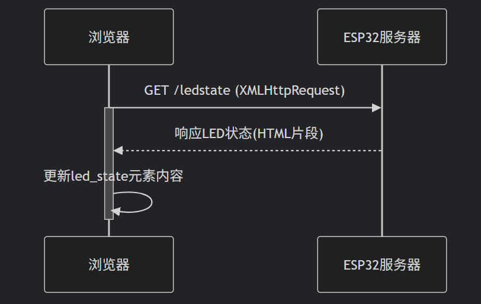
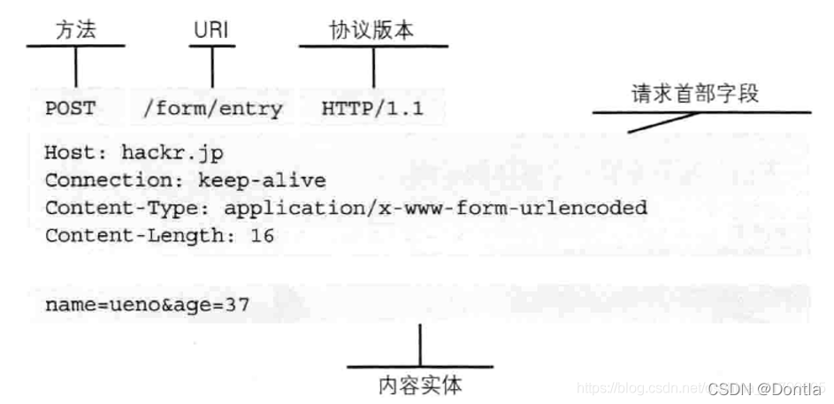

# 阶段二

## 简介

本项目基于 **ESP32** 模块，使用 `WiFi` 与 `WebServer` 库，通过搭建一个简易的 Web Server 实现网页控制 ESP32 开发板的 LED（GPIO 8）开关状态，并实时显示LED当前状态。

---

## 学习过程及Web服务器原理
1. **搭建Web服务器**
    1. 使用`WebServer server(80);`创建一个名为`server`的`Webserver`对象,监听`80`端口
    2. 使用`connectWiFi()`连接上WIFI，详情见阶段一
    3. 使用`createServer()`创建服务器，内含多个函数
       * `server.on("/", handleRoot);` --> 访问根目录时，执行`handleRoot`函数，该函数中通过`server.send`发送一个字符串，字符串中是网页的html
       * `server.onNotFound(handleNotfound);` --> `handleNotfound`处理没找到的情况
       * `server.on("/led", ledSwitch);`处理开关灯
2. **HTML页面**
   *  刚开始是按照B站的一个视频一步步跟着学，(链接：[使用ESP32接入WiFi网络，Arduino开发环境，超简单！](https://www.bilibili.com/video/BV1kY411b7bg/?spm_id_from=333.788.videopod.sections&vd_source=9c4a7a24a570d4b1fd3035947cdaa6c0))做的网页比较简陋，而且没有实时显示LED状态。
   *  后来搜了一个前端简易入门教程，学习了CSS和JavaScript，自主重新编了一个网页，居中了内容并且利用JS的DOM实现了LED状态显示，并且有颜色变化
3. **按钮控制开关灯**
   *  在`createServer()`里用`server.on("/led", ledSwitch);`处理开关灯
   * `ledSwitch`函数有一个参数`String ledswitch = server.arg("switch");`(例如：当访问`(ip)/led?switch=on`时参数为`on`)根据参数为on或off来使用`digitalWrite()`控制LED亮灭
   * 在HTML中的使用`<button onclick="switchLed('on')">TurnOn</button>`实现网页端控制LED状态。按下按钮触发`switchLed('on')`函数，该函数会向`/led?switch=`目录发送GET请求，从而被服务器响应触发`ledSwitch`函数开关灯
4. **使用Ajax实时显示LED状态**
   * 用`setInterval(getLedState, 1000);`设置刷新LED状态的间隔
   * 在`getLedState`中，创建一个新的XMLHttpRequest对象，向`/ledstate`发送GET请求，服务器收到请求后通过`server.send`响应,此时对象的状态改变，触发状态变化回调函数，当请求完成并成功时获取服务器发送的数据，改变html页面。
   * 原理如图: 

## 遇到的问题及改进
   1. `String`里包含的字符串不能带有双引号，否则与语言字符串逻辑冲突，读取出错，网页显示出错，使用`R"rawliteral(Html)rawliteral"` 实现正确显示
   2. `server.send`发送纯文本不好实现不同状态显示不同颜色，于是改为发送整行html，直接对网页html进行修改
## HTTP请求心得
   * HTTP协议是客户端与服务端进行交互时必须遵循的规则，用于 HTTP 协议交互的信息被称为 HTTP 报文
   * 请求端（客户端）的 HTTP 报文叫做请求报文，响应端（服务器端）的叫做响应报文。
   * HTTP 报文大致可分为报文首部和报文主体两块。
   * 请求报文是由请求方法、请求 URL、协议版本、可选的请求首部字段和内容实体构成。
   * 
   * GET 与 POST 请求
     * GET 请求: 一般用于获取网页的信息，数据位置存在URL里，所以安全性相对较低，并且由于URL长度限制，GET 请求的数据长度也受限(几KB)，但是具有简单，可缓存的优势
     * POST 请求: 一般用于提交数据，数据位于请求体内，数据长度可以很大，但通常不会被缓存

---

## 参考资料
- [3小时前端入门教程（HTML+CSS+JS）](https://www.bilibili.com/video/BV1BT4y1W7Aw/?spm_id_from=444.41.top_right_bar_window_custom_collection.content.click&vd_source=9c4a7a24a570d4b1fd3035947cdaa6c0)
- [JavaScript之Ajax](https://blog.csdn.net/weixin_50602266/article/details/121910781)
- [用 JavaScript 发起 HTTP 请求的几种方法](https://www.freecodecamp.org/chinese/news/the-most-popular-ways-to-make-an-http-request-in-javascript/)
- [使用ESP32接入WiFi网络，Arduino开发环境，超简单！](https://www.bilibili.com/video/BV1kY411b7bg/?spm_id_from=333.788.videopod.sections&vd_source=9c4a7a24a570d4b1fd3035947cdaa6c0)
- [HTTP协议详解（HyperText Transfer Protocol 超文本传输协议）访问控制(CORS) （OPTIONS预请求preflight request）浏览器同源策略](https://blog.csdn.net/Dontla/article/details/121189955)
- Arduino自带示例 (Webserver/HelloServer)