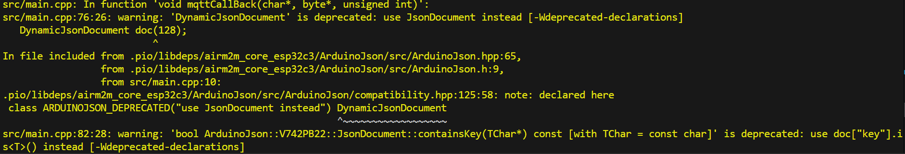
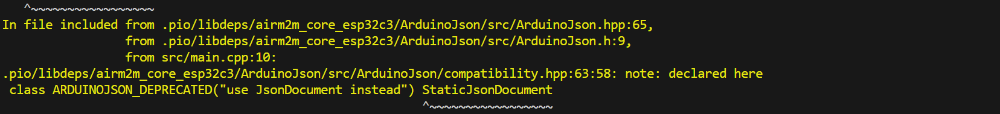

# 阶段四
* 本阶段采用EMQX Cloud平台，通过MQTT实现对ESP32开发板接收上传数据和下发指令

## 学习过程
* 选用了EMQX平台的Serverless部署来操作，需要准备MQTTX，注册账号
* 首先跟着官网的实例连接上了MQTTX和云平台，并且写了一段发布消息的代码
* 接着连接上BME280，将读取的浮点数变为json信息publish
* 最后写函数处理控制主题发来的json控制文本，由于是一个一个字符读取，所以先转成字符串，在转成json操作，通过对比键值对内容来判断开关灯

## MQTT协议笔记
1. 简介
   * MQTT是一个基于TCP/IP的轻量级的通信协议，专为资源受限的设备设计，具有轻量级，低功耗，可靠性高并且易于实现的特点。
2. 工作原理
   * 发布/订阅模式：通信双方是发布者（Publisher）和订阅者（Subscriber），通过一个代理（Broker）进行消息的传递
     * 发布者：产生消息并发送给代理，消息分为`Topic`和`Payload`两个部分，`Payload`是消息的内容。
     * 代理：作为消息的中转站，它接收来自发布者的消息，并根据消息的主题（Topic）将消息转发给订阅了该主题的订阅者。
     * 订阅者：向代理订阅主题，当代理收到与该主题匹配的消息时，就会将消息推送给订阅者。
   * 定义了三种消息服务质量（QoS）等级，用于在可靠性和带宽消耗权衡
     * QoS 0（最多一次）：消息从发布者发送到代理后，代理最多向订阅者发送一次消息。这种情况下，消息可能会丢失，但不会重复发送。它消耗的带宽最少，适用于对消息可靠性要求不高的场景
     * QoS 1（至少一次）：保证消息至少被代理发送到订阅者一次。代理会发送消息给订阅者，并等待订阅者的确认。如果在规定时间内没有收到确认，代理会重发消息。这种情况下，消息可能会重复发送，但不会丢失。
     * QoS 2（恰好一次）：最高级别的消息质量等级，保证消息恰好被代理发送到订阅者一次，但会消耗更多的带宽和资源。
   * 报文结构
     * 固定头+可变头+有效载荷
   * 主要报文类型
     * CONNECT：客户端向代理发送的连接请求报文。在该报文中，客户端会提供一些连接参数，如客户端标识符（Client ID）、用户名、密码等。代理根据这些参数来决定是否允许客户端连接。
     * CONNACK：代理对客户端的CONNECT报文的响应。它告诉客户端连接是否成功，以及一些连接相关的参数，如会话是否保留等。
     * PUBLISH：发布者向代理发送消息的报文。它包含了消息的主题、QoS等级、消息内容等信息。
     * SUBSCRIBE：订阅者向代理发送的订阅请求报文。订阅者在该报文中指定要订阅的主题和期望的QoS等级。
     * SUBACK：代理对订阅者SUBSCRIBE报文的响应。它告诉订阅者订阅请求是否成功，以及实际分配给该订阅的QoS等级。
     * UNSUBSCRIBE：订阅者向代理发送的取消订阅请求报文。订阅者在该报文中指定要取消订阅的主题。
     * UNSUBACK：代理对UNSUBSCRIBE报文的响应，表示取消订阅操作已经完成。
     * PINGREQ：客户端向代理发送的心跳请求报文。客户端定期发送该报文以保持与代理的连接，防止代理认为客户端已经断开连接。
     * PINGRESP：代理对PINGREQ报文的响应，告诉客户端代理仍然处于连接状态。
     * DISCONNECT：客户端向代理发送的断开连接请求报文。客户端在该报文中可以指定断开连接的原因等信息。

## EMQX平台使用方法
   1. 注册EMQX平台账号，登录EMQXPlatform控制台，在起始页点击新建部署，创建Serverless部署，添加客户端认证信息
   2. 安装MQTTX，填入名称，控制台内给的服务器地址，端口，客户端认证的用户名和密码（Serverless还要勾选TLS/SSl和CA证书两项） 即可完成连接
   3. 然后在MQTTX里点击添加订阅，设置好主题和QoS后就订阅好了主题
   4. 随后在Arduino里安装`PubSubClient`库，准备好需要的WIFI名称密码，服务器地址和端口，客户端名称和密码，还有MQTTX里订阅的主题，最后下载EMQXPlatform控制台给的CA证书，全部存到字符串里就完成了ESP32连接MQTT的准备
   5. 跟随官网的实例连接上MQTT即可，此处给出链接，便不多赘述：[使用ESP32连接](https://docs.emqx.com/zh/cloud/latest/connect_to_deployments/esp32.html)

## JSON数据格式设计
* 上传温湿度使用两个键值对：`"Tem"``"Hum"`分别代表温度和适度，分别对应一个浮点数值
* LED控制模块的JSON使用一个键值对：`"led"`，它的值为一个字符串，"ON" 或 "OFF"，通过读取键值对的值，与预设的字符串比较便可判断开关灯

## 遇到的问题
  * 报警告：
    查询后得知是采用的是旧的类名和方法，建议更新代码
    于是作出修改：
    `DynamicJsonDocument` `StaticJsonDocument` ---> `JsonDocument` 
    `doc.containsKey("led)` ---> `!doc["led"].isNull()`
  * 第二个主题发布操作信息后ESP32过了很久才做出反应 --> 又是delay的锅
  * 改用millis后，开关灯一次，主题就不断收到OK消息（原设想是开关灯操作完成后发一次）---> OK消息发送到了控制主题，且在代码里的限制仅仅是主题为控制主题，所以ESP32检测到控制主题发消息了就又执行了一次发送OK操作，像左脚踩右脚一般无限发送
    > 最终删去了OK消息，改为在串口发送完成信息

## 参考资料
[EMQX云平台](https://blog.csdn.net/qq_39724355/article/details/132987855)
[EMQX官网](https://www.emqx.com/zh/mqtt/public-mqtt5-broker)
[EMQX快速入门](https://docs.emqx.com/zh/cloud/latest/quick_start/introduction.html)
[连接ESP32](https://docs.emqx.com/zh/cloud/latest/connect_to_deployments/esp32.html#%E9%80%9A%E8%BF%87-tls-ssl-%E7%AB%AF%E5%8F%A3%E8%BF%9E%E6%8E%A5)
[连接MQTTX](https://docs.emqx.com/zh/cloud/latest/connect_to_deployments/mqttx.html)
[MQTT协议详解](https://blog.csdn.net/jackwmj12/article/details/129163012)
